---
search:
  exclude: true
---

# Reference Deployment

## 1. Description

The reference deployment application is to demonstrate a collection of ISF components interconnected to form a deployment. The deployment represents a "reference" spacecraft that includes commanding, events, telemetry channels and parameters.

The application illustrates some example application components:

|Component|Description|Link
|---|---|---|
|SendBuffApp | A component that sends a buffer | [SDD](../SendBuffApp/docs/sdd.md) |
|RecvBuffApp | A component that receives a buffer | [SDD](../RecvBuffApp/docs/sdd.md) |
|BlockDriver  | A notional driver that relays buffers from SendBuffApp to RecvBuffApp | [SDD](../BlockDriver/docs/sdd.md)|
|SignalGen | A component that generates telemetry following a waveform| [SDD](../SignalGen/docs/sdd.md)|
|PingReceiver|A test component that gets health pings that can be turned off| [SDD](../SignalGen/docs/sdd.md)| 

It interconnects those application components with reusable service components:

|Component|Description|Link
|---|---|---|
|EventManager|Logs events for downlink| [SDD](../../Svc/EventManager/docs/sdd.md)|
|ActiveRateGroup|Executes a rate group by calling components| [SDD](../../Svc/ActiveRateGroup/docs/sdd.md)|
|BufferManager|Manages a pool of buffers| [SDD](../../Svc/BufferManager/docs/sdd.md)|
|CmdSequencer|Loads a set of commands from a binary file and executes them| [SDD](../../Svc/CmdSequencer/docs/sdd.md)|
|CmdDispatcher|Dispatches commands from a ground system to registered components| [SDD](../../Svc/CmdDispatcher/docs/sdd.md)|
|FileDownlink|Component to downlink files to ground system| [SDD](../../Svc/FileDownlink/docs/sdd.md)|
|FileManager|Component to perform various file operations| [SDD](../../Svc/FileManager/docs/sdd.md)|
|FileUplink|Component to receive uplinked files from ground system| [SDD](../../Svc/FileUplink/docs/sdd.md)|
|Health|Pings active components in the topology to verify their aliveness| [SDD](../../Svc/Health/docs/sdd.md)|
|PrmDb|Loads sets of parameters from storage at startup and provides them to components| [SDD](../../Svc/PrmDb/docs/sdd.md)|
|RateGroupDriver|Sends messages to ActiveRateGroup instances to run a cycle| [SDD](../../Svc/RateGroupDriver/docs/sdd.md)|
|TlmChan|Provides storage for telemetry channels and periodically sends them to the ground system| [SDD](../../Svc/TlmChan/docs/sdd.md)|
|PolyDb|Manages a database of polymorphic data values| [SDD](../../Svc/PolyDb/docs/sdd.md)|

There is a set of useful utility components that can be used on supported operating systems:

|Component|Description|Link
|---|---|---|
|PosixTime|Provides time stamps for telemetry on a posix systems| [SDD](../../Svc/PosixTime/docs/sdd.md)|
|PassiveConsoleTextLogger|Prints the text form of events to standard output| [SDD](../../Svc/PassiveConsoleTextLogger/docs/sdd.md)|

## 2. Topology

The topology of the reference example is the interconnection of all the components used in the reference deployment (a deployment is a set of components connected together and compiled into a binary). There are a large number of connections so it is not feasible to show them all in one diagram. The following sections have views of the topology that show the connections for a particular purpose. The topology diagrams will be broken down into the core set of Command and Data Handling (C&DH) connections that would be reused from project to project as well as the connections unique to the reference example. The diagrams were generated using MagicDraw, while the FPP defining the topology connections was generated using the MagicDraw plug-in developed for ISF.

### 2.1 Commanding

The commanding view consists of connections for components to register commands, the dispatching of commands and the return of command execution status. 

#### 2.1.1 C&DH Commanding

The connections for the C&DH commanding are as follows:

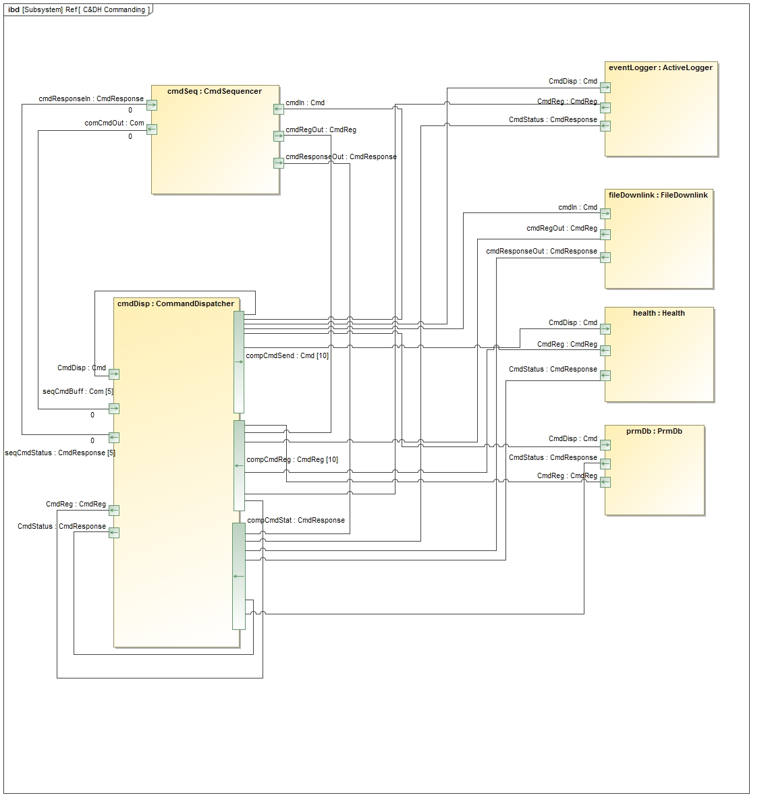

#### 2.1.2 Reference Deployment Commanding

The connections for the reference deployment commanding are as follows:

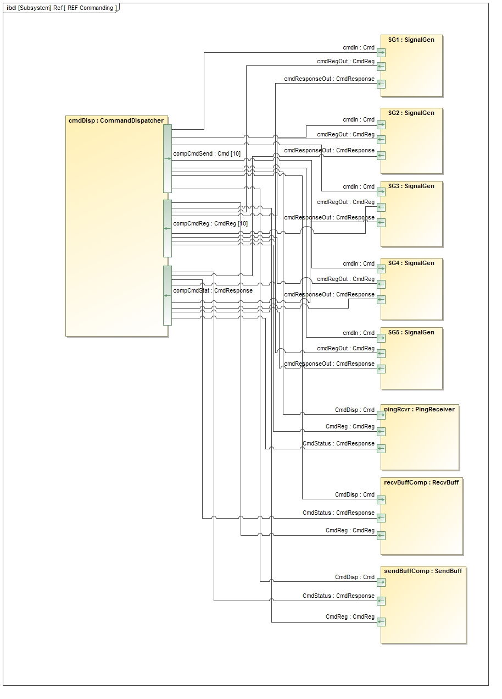

### 2.2 Telemetry

The telemetry view consists of connections for components to update telemetry channels in the `TlmChan` component. 

#### 2.2.1 C&DH Telemetry

The connections for the C&DH telemetry are as follows:

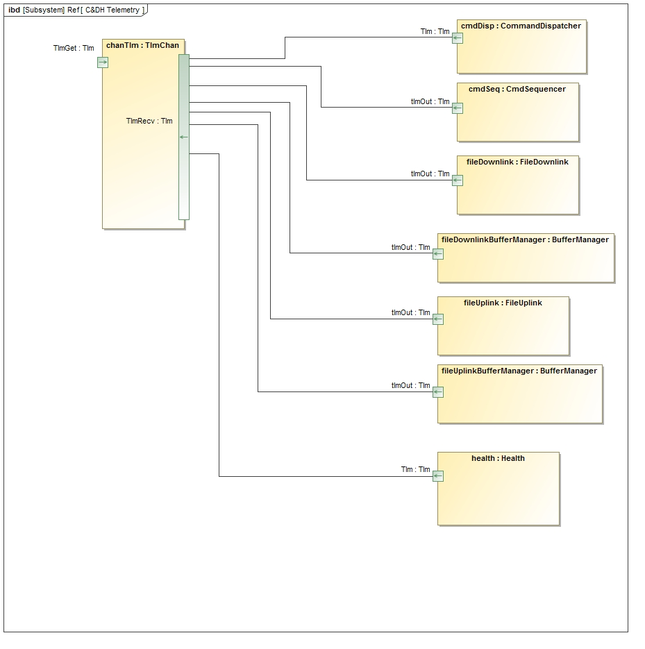

#### 2.2.2 Reference Deployment Telemetry

The connections for the reference deployment telemetry are as follows:

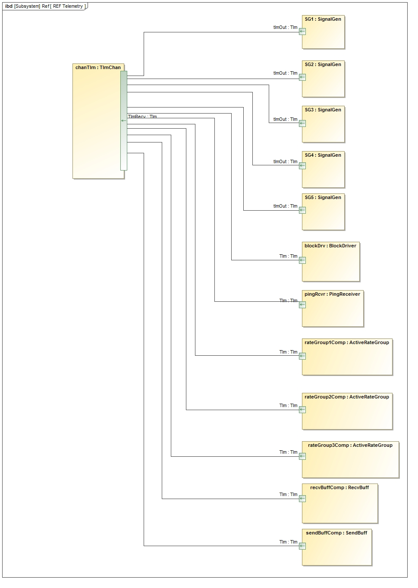

### 2.3 Logging

The logging view consists of connections for components to send events for logging to the `EventManager` component. 

#### 2.3.1 C&DH Logging

The connections for the C&DH logging are as follows:

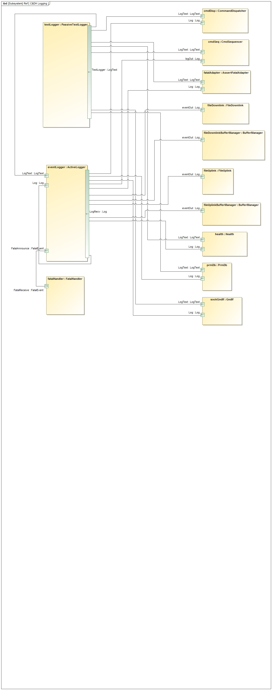

#### 2.3.2 Reference Deployment Logging

The connections for the reference deployment logging are as follows:

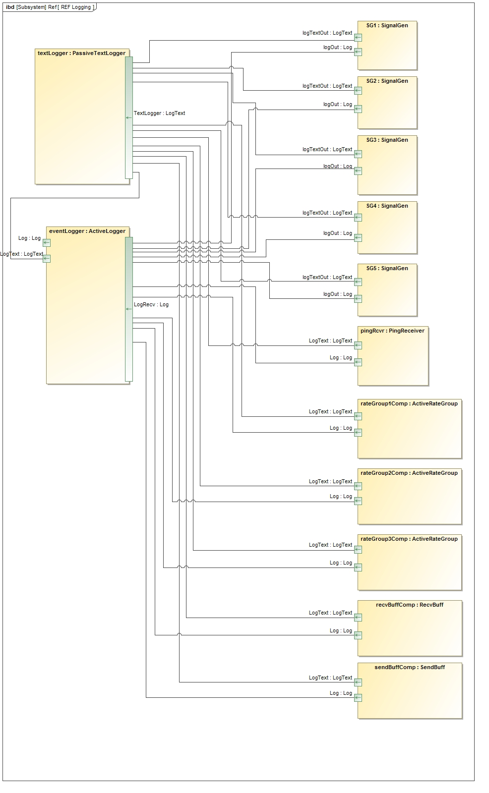

### 2.4 Parameters

The parameters view consists of connections for components to retrieve and update parameters stored in the `PrmDb` component. 

#### 2.3.1 C&DH Parameters

The core C&DH components do not have any parameters.

#### 2.3.2 Reference Deployment Parameters

The connections for the reference deployment parameters are as follows:

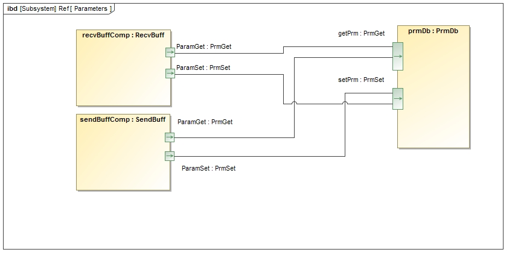

### 2.5 Time

The time view consists of connections for components to get time for time-tagging events and telemetry. 

#### 2.5.1 C&DH Time

The connections for the C&DH time are as follows:

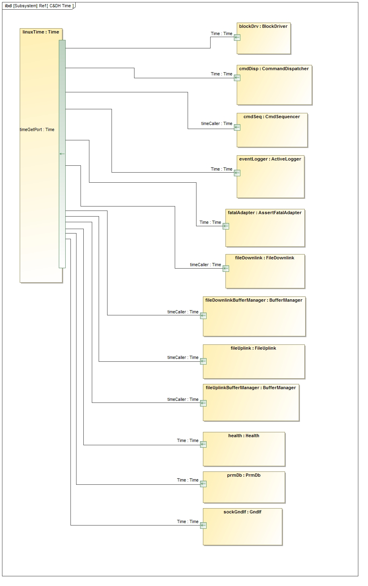

#### 2.5.2 Reference Deployment Time

The connections for the reference deployment time are as follows:

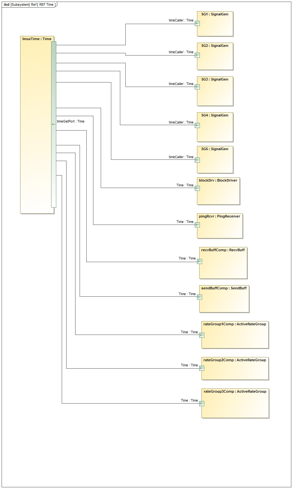

### 2.6 Health

The health view consists of connections for components to respond to pings from `Health`to verify their threads are alive. 

#### 2.6.1 C&DH Time

The connections for the C&DH health are as follows:

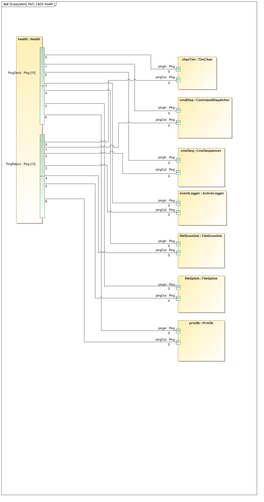

#### 2.6.2 Reference Deployment Health

The connections for the reference deployment health are as follows:

### 2.7 Rate Groups

The rate group view consists of connections for components to be executed at different rates in the reference topology. 

The connections for the rate groups are as follows:

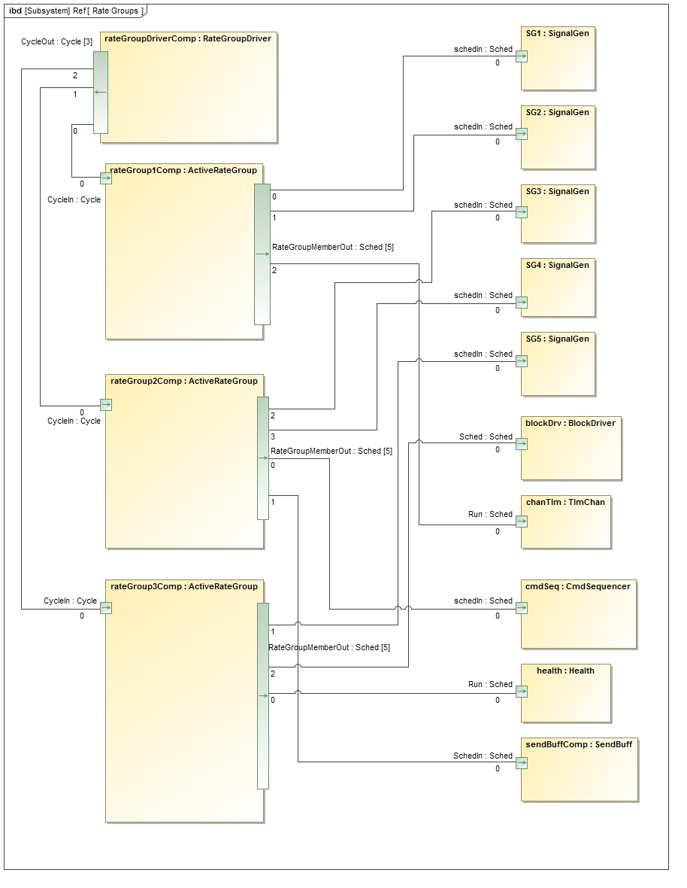

### 2.8 Ground

The ground view consists of connections for C&DH components to receive commands from and send telemetry to a ground system. The ground system in the reference example is communicated with via a TCP/IP socket. 

The connections for the ground system are as follows:

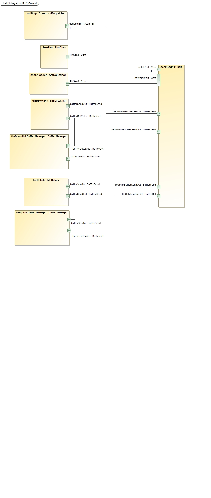

### 2.9 Drivers

The drivers view consists of connections for the reference components to send packets to and from the example "driver." The driver also provides ticks to the `RateGroupDriver` component that cycles the rate groups.

The connections for the drivers are as follows:

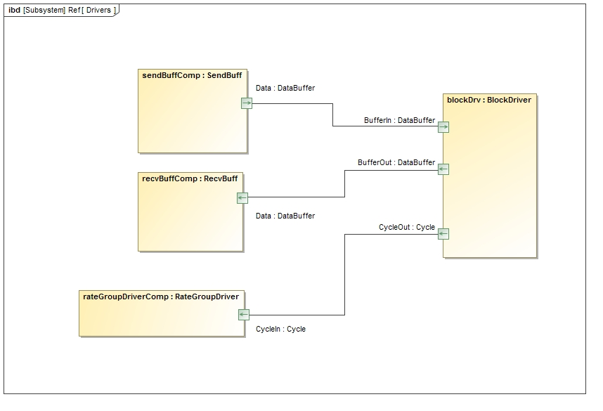

## 3. Change Log

Date | Description
---- | -----------
6/19/2015 | Initial version
4/20/2017 | Rel1.9

